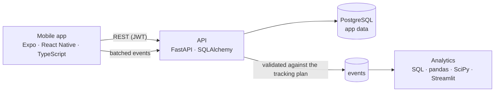

# Homi

[](https://github.com/Mariam-Fathi/homi/actions/workflows/ci.yml)

A real-estate app for the Egyptian market, used as a full-stack and data-science case
study. I built the mobile app, the backend, an event-tracking pipeline, an
experimentation system and a recommender, then used them to answer three product
questions with pre-registered analyses.

People browse listings, save favorites and **request a viewing** (the conversion),
which moves through an agent pipeline with a notification at every step.

**One-page summary for reviewers: [docs/summary.md](docs/summary.md)**

## Findings

| Question | Answer | Evidence |
|---|---|---|
| Where does the funnel leak? | Each weak property type fails at a different stage: villas at **conversion**, commercial units at **interest**, townhouses at **visibility**. A selection effect hides commercial's problem if you only look at the last step. | [Case study 1](docs/case-study-funnel.md) |
| Does formatting the phone number help guests book? | Yes: **+9.1 points** in viewing requests (95% CI +2.7 to +15.6, p = 0.006), with validation failures more than halved. Shipped by a pre-registered rule. | [Case study 2](docs/case-study-experiment.md) |
| Can a learned model beat the hand-written recommendation rule? | The offline winner (popularity) **cut recommendation opens by 43%** online; the pre-registered three-arm test caught it. The hybrid model's real gain was smaller than the test could detect: keep the rule, retest with more power. | [Case study 3](docs/case-study-recommender.md) |

The users in these studies are **simulated and labeled as such**: a demo app has no
real traffic. The simulator plants known effects, and every analysis is checked
against them in CI, so the methods are shown to work before they're trusted. The same
code runs unchanged on real events.

## Architecture



| Part | Stack | What's in it |
|---|---|---|
| [`mobile/`](mobile) | Expo SDK 52, React Native, TypeScript (strict), NativeWind, Zustand | Typed API client, encrypted token storage, per-country phone validation, optimistic favorites, viewing-request flow, offline-safe event tracking |
| [`backend/`](backend) | Python 3.12, FastAPI, SQLAlchemy 2, Alembic, PostgreSQL 16, NumPy | Phone and guest sign-in (JWT), status pipeline with enforced transitions, event ingestion, hash-based experiment assignment, five recommendation models |
| [`analytics/`](analytics) | SQL, pandas, SciPy, Streamlit | Funnel data model and diagnosis, A/B test design and analysis, offline recommender evaluation, a user simulator with planted effects, dashboard |
| [`docs/`](docs) | | [Tracking plan](docs/tracking-plan.md), [funnel analytics](docs/funnel-analytics.md), [experimentation](docs/experimentation.md), [recommender](docs/recommender.md), three case studies |
| CI | GitHub Actions | Lint, type checks, 158 tests, migration drift check, Docker end-to-end smoke test |

## Run it locally

You need Docker and Node 22.

```bash
docker compose up -d --build --wait
```
```bash
docker compose exec api python -m app.seed
```

The API runs at http://localhost:8000 (interactive docs at http://localhost:8000/docs)
with 40 reproducible listings across Cairo, Giza, Alexandria and the coast. Then the app:

```bash
cd mobile && cp .env.example .env && npm install && npm start
```

Press `w` for the web version, or scan the QR code with a development build (on the
Android emulator, set `EXPO_PUBLIC_API_URL=http://10.0.2.2:8000` in `mobile/.env`).
Sign in with a name and mobile number, or tap "Continue as Guest".

The analytics, simulator and dashboard have their own setup:
[analytics/README.md](analytics/README.md).

## Tests

| Suite | Command | Covers |
|---|---|---|
| Backend (69) | `cd backend && pytest` | Every endpoint against a real PostgreSQL built through the migrations; event ingestion; assignment; recommendation models |
| Mobile (53) | `cd mobile && npm test` | API client, event tracker (offline queue, retries, sessions), impressions, phone validation, experiments, stores; a contract test against the backend's event registry |
| Analytics (36) | `cd analytics && pytest` | SQL data model; A/B statistics (false-positive rate and power, by simulation); the analysis recovering every planted effect; offline evaluation; dashboard rendering |
| End to end | `python backend/scripts/smoke_test.py` | The whole user journey against the running Docker stack |

Backend and analytics tests use the Docker database, which listens on port **5433** so
it doesn't clash with a locally installed PostgreSQL.

## Design decisions

- **Own backend instead of a BaaS.** The app started on Appwrite. A backend I control
  enforces rules in one place (one open viewing request per property, valid status
  transitions), deletes accounts for real, and owns the data model the analytics
  depends on.
- **The conversion is a viewing request, not a payment.** Payments in a demo aren't
  realistic; a viewing request is what a real-estate funnel optimizes for.
- **Events have one owner.** Outcomes (sign-ups, favorites, viewing requests) are
  recorded by the server in the same transaction as the change, so they can't be lost
  or faked; only what the server can't see comes from the app. The two event lists are
  checked against each other in CI.
- **Analyses are validated before they're trusted.** The simulator plants known
  problems and effects; CI fails if the analysis misses one or raises a false alarm.
- **Experiments are decided in advance.** Metric, sample size and decision rule are
  [written down before a test runs](docs/experimentation.md); results are read once, at
  the planned size, and the dashboard shows no verdict before then.
- **Offline scores aren't the final word.** The recommender that won offline lost
  online ([case study 3](docs/case-study-recommender.md)).
- **Phone sign-in without SMS codes.** Numbers are validated per country with Google's
  libphonenumber and must be mobiles, but ownership isn't verified: a one-time code
  needs a paid SMS provider, out of scope for a demo. Anyone who knows a number can
  open that account (though not rename it). OTP is the first step before real users.
- **Reproducible everything.** Fixed seeds and end dates regenerate every dataset and
  every number in the case studies exactly.

## How it was built

The project started as a tutorial-style Expo + Appwrite app and was rebuilt in five
phases, each merged as its own pull request:

1. **Own backend:** FastAPI + PostgreSQL, viewing-request pipeline, CI
2. **Event tracking:** [tracking plan](docs/tracking-plan.md), offline-safe client, validated ingestion
3. **Funnel analytics:** data model, diagnosis, simulator, dashboard
4. **Experimentation:** assignment, exposure logging, a pre-registered A/B test
5. **Recommender:** five models, time-split offline evaluation, a three-arm online test
