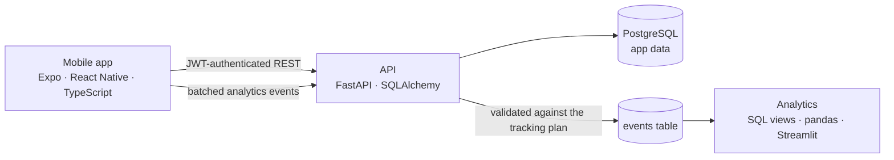

# Homi

[](https://github.com/Mariam-Fathi/homi/actions/workflows/ci.yml)

A real-estate app for the Egyptian market, built as a full-stack and data case study:
a React Native app, a FastAPI + PostgreSQL backend I designed and built myself, and
(in progress) an event-analytics and A/B-testing layer on top.

Users browse listings, save favorites, and **request a viewing**. That request is the
app's conversion event. It then moves through an agent pipeline
(requested → contacted → scheduled → completed), and every step notifies the user.

## Architecture



| Part | Stack | Highlights |
|---|---|---|
| [`mobile/`](mobile) | Expo SDK 52, React Native, TypeScript (strict), NativeWind, Zustand | Typed API client, encrypted token storage, per-country phone validation, optimistic favorites, viewing-request flow |
| [`backend/`](backend) | Python 3.12, FastAPI, SQLAlchemy 2, Alembic, PostgreSQL 16 | Phone + guest sign-in (JWT), libphonenumber validation, status pipeline with transition rules, rule-based recommendations, cascade-delete account removal |
| Event tracking | [Tracking plan](docs/tracking-plan.md), shared JSON contract | 20 events; offline-safe batched client; validated, idempotent ingestion; server-recorded outcomes |
| [`analytics/`](analytics) | SQL, pandas, Streamlit | Funnel data model, per-stage diagnosis, a user simulator with planted problems, dashboard |
| CI | GitHub Actions | Lint, type-check, unit/integration tests, migration drift check, Docker end-to-end smoke test |

## Run it locally

You need Docker and Node 22.

```bash
docker compose up -d --build --wait
```
```bash
docker compose exec api python -m app.seed
```

The API is now at http://localhost:8000 (interactive docs at http://localhost:8000/docs),
seeded with 40 reproducible listings across Cairo, Giza, Alexandria and the coast.

Start the app:

```bash
cd mobile && cp .env.example .env && npm install && npm start
```

Press `w` for the web version, or scan the QR code with a development build. On the
Android emulator, set `EXPO_PUBLIC_API_URL=http://10.0.2.2:8000` in `mobile/.env`.
Sign in with a name and mobile number, or tap "Continue as Guest".

## Tests

| Suite | Command | What it covers |
|---|---|---|
| Backend | `cd backend && pytest` | Every endpoint against a real PostgreSQL, with the schema built through the actual migrations |
| Mobile | `cd mobile && npm test` | API client, phone validation, auth and favorites stores, data-fetching hook |
| Analytics | `cd analytics && pytest` | The SQL data model, and that the analysis recovers every problem planted by the simulator |
| End to end | `python backend/scripts/smoke_test.py` | The full user journey against the running Docker stack |

Backend tests expect the Docker database (`docker compose up -d db`), which exposes
PostgreSQL on port **5433** so it doesn't clash with a locally installed one.

## Design decisions

- **Own backend instead of a BaaS.** The app started on Appwrite. Moving to a backend I
  control made it possible to enforce rules in one place (one open viewing request per
  property, valid status transitions), delete accounts for real, and own the data model
  that the analytics work builds on.
- **The conversion is a viewing request, not a payment.** Payments in a demo app aren't
  realistic, while a viewing request is what a real-estate funnel actually optimizes for.
- **Phone sign-in without SMS codes.** Users sign in with a name and mobile number.
  Numbers are validated against each country's numbering plan (Google's libphonenumber,
  on both the app and the server), must be mobiles, and are stored in E.164 format.
  Ownership isn't verified with a one-time code: that needs a paid SMS provider and is
  out of scope for a demo, so anyone who knows a number can open that account. An
  existing account's name can't be changed by signing in again. Adding OTP is the
  first step before real users.
- **Guest accounts.** Anyone can try the app in one tap; each guest is a separate
  user, so their activity doesn't mix.
- **Events have one owner.** Outcomes (sign-ups, favorites, viewing requests) are
  recorded by the server in the same transaction as the change, so they can't be lost
  or faked; only interactions the server can't see come from the app. The app's event
  list and the API's registry are checked against each other in CI.
- **Validated analytics.** A demo app has no real users, so a simulator generates
  labeled usage with known problems planted on purpose. The analysis must find all of
  them, with no false alarms, in CI on every change: evidence the method works before
  it's trusted on real data.
- **Reproducible data.** The seed uses a fixed random seed, so every analysis built on it
  can be re-run and checked.

## Roadmap

- [x] **Phase 1 — Own backend:** FastAPI + PostgreSQL, viewing-request pipeline, CI
- [x] **Phase 2 — Event tracking:** [tracking plan](docs/tracking-plan.md), batched offline-safe client, validated ingestion API
- [x] **Phase 3 — Funnel analytics:** data model, diagnosis, simulator, dashboard — [case study](docs/case-study-funnel.md)
- [ ] **Phase 4 — Experimentation:** assignment service, user simulator, A/B test with power analysis
- [ ] **Phase 5 — Recommender:** learned model evaluated offline and online against today's rule-based baseline
