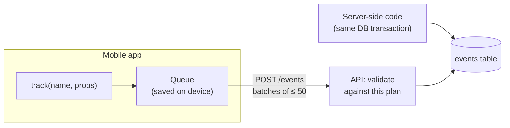

# Tracking plan

This document defines every analytics event Homi records: its name, when it fires,
who sends it, and its properties. It is the contract between the app (which sends
events), the API (which validates and stores them), and the analysis (which reads
them). An event that isn't listed here is rejected.

## Questions the data must answer

Every event exists to answer at least one of these. Events that answer none are
not tracked.

1. **Funnel:** of the people who see a property, how many open it, save it, start
   the viewing form, and send a request? Where do they drop off?
2. **Diagnosis:** is a weak property type failing at visibility (few impressions),
   interest (few opens), or conversion (opens but no requests)?
3. **Form friction:** how many people abandon the viewing form, and which field
   stops them?
4. **Discovery:** do search and filters lead to viewings, or to dead ends?
5. **Notifications:** do recommendation notifications get opened, and do they lead
   to viewings?
6. **Retention:** do users come back, and does activity in the first session predict it?
7. **Experiments:** every metric above must be computable per experiment variant,
   for the people actually exposed to it.

## Funnel

```mermaid
flowchart LR
    imp["property_impression<br/>(card shown)"] --> click["property_card_clicked"]
    click --> view["property_viewed"]
    view --> fav["favorite_added"]
    view --> open["viewing_form_opened"]
    open --> req["viewing_requested ✅"]
    open -. "closed without sending" .-> ab["viewing_form_abandoned"]
```

`viewing_requested` is the **conversion event**: the outcome the business cares about.

## Who sends what

| Source | Used for | Why |
|---|---|---|
| **Server** | Outcomes: sign-ups, favorites, viewing requests, status changes, notifications created | Recorded in the same transaction as the database change, so it can't be lost or faked. These are the numbers to trust for business metrics. |
| **App** | Interactions: screens, impressions, clicks, form behavior, searches | Only the app can see them. Some will be lost (app killed, phone offline for days), so interaction metrics are slight undercounts. |

An event is sent from only one place, so nothing is counted twice. The one exception
is `experiment_exposed`: the app records exposure to experiments that change the app,
and the server to experiments it runs itself (such as which model picks a
recommendation). A given experiment only ever records it from one side.

## Properties on every event

Added automatically; individual events never set these themselves.

| Property | Type | Description |
|---|---|---|
| `event_id` | UUID | Generated where the event happens. Retried uploads reuse it, so each event is stored once. |
| `event_name` | string | One of the events below. |
| `occurred_at` | timestamp | When it happened, by the sender's clock. |
| `received_at` | timestamp | When the API stored it, by the server's clock. Used to detect wrong phone clocks. |
| `user_id` | string \| null | Who was signed in **when the event happened**. The app records it, but the server only keeps it if it matches the login token on the upload, so events can't be attributed to someone else. Null before sign-in, even for events uploaded after signing in. |
| `anonymous_id` | UUID | Random ID created on first launch and kept on the device. Links what someone did before signing in to who they became. |
| `session_id` | UUID | A new session starts on launch, or after 30 minutes without events. |
| `platform` | `ios` \| `android` \| `web` \| `server` | |
| `app_version` | string | From the app config; `server` events use the API version. |

## Events

Naming: `object_action` in past tense, snake_case (`property_viewed`, not `viewProperty`).

### Session & account

| Event | Source | Fires when | Properties |
|---|---|---|---|
| `app_opened` | app | The app is launched or returns from the background | `cold_start`: bool |
| `screen_viewed` | app | A screen becomes visible | `screen`: `auth` \| `home` \| `explore` \| `property` \| `favorites` \| `notifications` \| `viewings` \| `profile` |
| `sign_in_failed` | app | Sign-in is blocked by validation or rejected by the API | `reason`: `invalid_name` \| `invalid_phone` \| `not_mobile` \| `server_error` |
| `signed_up` | server | A new account is created | `method`: `phone` \| `guest` |
| `signed_in` | server | An existing account signs in | `method`: `phone` |
| `signed_out` | app | The user logs out | — |

### Discovery

| Event | Source | Fires when | Properties |
|---|---|---|---|
| `search_performed` | app | A search runs (after the 500 ms typing pause) | `query`: string (max 100 chars), `results_count`: int |
| `filter_applied` | app | A property-type filter is selected or cleared | `filter`: string (`All` when cleared), `results_count`: int |
| `property_impression` | app | A property card is shown in a list (once per card, list and screen visit) | `property_id`, `list`: `featured` \| `home` \| `explore` \| `favorites`, `position`: int (0-based) |
| `property_card_clicked` | app | A property card is tapped | `property_id`, `list`, `position` |
| `property_viewed` | app | The property details screen loads | `property_id`, `source`: `card` \| `notification` \| `viewings` \| `push` \| `link` |

### Engagement & conversion

| Event | Source | Fires when | Properties |
|---|---|---|---|
| `favorite_added` | server | A property is saved | `property_id` |
| `favorite_removed` | server | A property is unsaved | `property_id` |
| `viewing_form_opened` | app | The Request a Viewing form opens | `property_id` |
| `viewing_form_validation_failed` | app | Send is pressed with an invalid field | `property_id`, `field`: `phone` |
| `viewing_form_abandoned` | app | The form closes without a successful request | `property_id`, `seconds_open`: int |
| `viewing_requested` ✅ | server | A viewing request is created | `property_id`, `request_id`, `time_slot`, `days_ahead`: int |
| `viewing_status_changed` | server | An agent (or the user) moves a request through the pipeline | `request_id`, `property_id`, `from_status`, `to_status`, `changed_by`: `agent` \| `user` |

### Notifications

| Event | Source | Fires when | Properties |
|---|---|---|---|
| `notification_created` | server | A notification is created for a user | `notification_id`, `kind`: `welcome` \| `recommendation` \| `viewing_status`, `property_id`: string \| null |
| `notification_opened` | app | A notification is tapped (in the list or as a push) | `notification_id` \| null, `kind`, `property_id`: string \| null, `via`: `list` \| `push` |

### Experiments

| Event | Source | Fires when | Properties |
|---|---|---|---|
| `experiment_exposed` | app or server | An experiment's variant first changes what the person sees (not when they're merely assigned) | `experiment`: string, `variant`: string |

See [experimentation.md](experimentation.md) for why exposure, not assignment, defines
who is in an experiment.

## Privacy rules

- No names, phone numbers or free-text messages in event properties. The only
  free text is the search `query`, capped at 100 characters.
- Deleting an account deletes all of that user's events, matching the promise in
  the Delete Account dialog. (Aggregates already computed from them are kept.)
- Events are used only for product analytics in this project, and never sent to
  third parties.

## How events flow



- **Batching:** the app sends events every 10 seconds, when 20 are waiting, or when
  the app goes to the background.
- **Offline:** the queue is saved on the device and sent when the connection returns.
  It's capped at 1,000 events, dropping the oldest first.
- **Retries:** failed uploads retry with increasing delays. The server ignores events
  whose `event_id` it already stored, so retries never create duplicates.
- **Validation:** each event is checked against this plan (name, required properties,
  types, allowed values). Invalid events are rejected individually and the response
  says why, so one bad event doesn't lose the whole batch.
- **Clock skew:** `occurred_at` more than 24 hours in the future is replaced by
  `received_at` and flagged.

## Keeping this plan and the code in sync

The API's event definitions are the machine-readable version of this document. A
test fails if the app's list of event names differs from the API's, so an event
can't be added in one place and forgotten in the other.

## Changing the plan

Add new events freely. Never change the meaning of an existing event or property:
add a new one and stop sending the old one instead, so historical data keeps
meaning what it meant.
